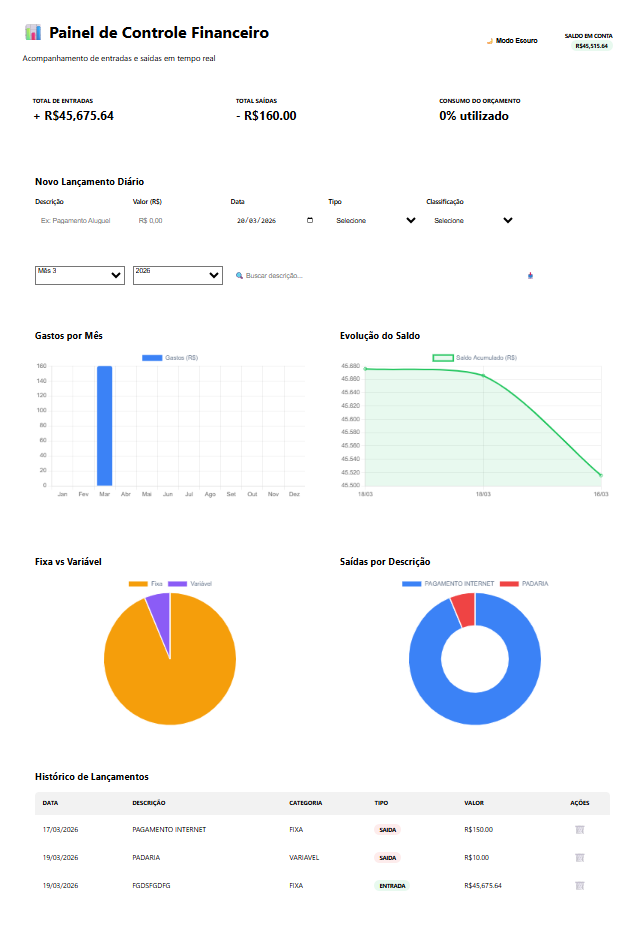

# 📊 Painel de Controle Financeiro

Aplicação web desenvolvida para controle financeiro pessoal, permitindo o acompanhamento de entradas, saídas, saldo e análise de gastos de forma visual e intuitiva.

---

## 🚀 Funcionalidades

- ✅ Cadastro de lançamentos (entrada e saída)
- ✅ Cálculo automático do saldo
- ✅ Filtro por mês e ano
- ✅ Busca por descrição
- ✅ Dashboard com gráficos:
  - 📈 Evolução do saldo
  - 📊 Gastos por mês
  - 🥧 Distribuição fixa vs variável
  - 🍩 Saídas por categoria
- ✅ Histórico completo de lançamentos
- ✅ Modo escuro 🌙

---

## 🖼️ Preview da Aplicação



>`

---

## 🛠️ Tecnologias Utilizadas

- Angular
- TypeScript
- HTML5
- CSS3
- Chart.js (ou outra lib de gráfico que você usou)
- RxJS

---

## 📂 Estrutura do Projeto

```
src/
 ├── app/
 │   ├── components/
 │   ├── services/
 │   ├── models/
 │   └── pages/
 ├── assets/
 │   └── dashboard.png
 └── environments/
```

---

## ⚙️ Como rodar o projeto

### 1️⃣ Clonar o repositório

```bash
git clone https://github.com/seu-usuario/seu-repositorio.git
```

### 2️⃣ Entrar na pasta

```bash
cd seu-repositorio
```

### 3️⃣ Instalar dependências

```bash
npm install
```

### 4️⃣ Rodar a aplicação

```bash
ng serve
```

### 5️⃣ Acessar no navegador

http://localhost:4200

---

## 📊 Funcionalidades do Dashboard

O painel apresenta:

- 💰 **Total de Entradas**
- 💸 **Total de Saídas**
- 📉 **Consumo do orçamento**
- 📅 Controle por data
- 📌 Classificação dos lançamentos (fixo/variável)

---

## 📌 Melhorias Futuras

- 🔐 Sistema de login/autenticação
- ☁️ Integração com backend/API
- 📱 Responsividade mobile
- 📤 Exportação de relatórios (PDF/Excel)
- 🔔 Alertas de gastos

---

## 🤝 Contribuição

Sinta-se à vontade para contribuir:

1. Fork o projeto
2. Crie uma branch (`git checkout -b feature/minha-feature`)
3. Commit (`git commit -m 'Minha nova feature'`)
4. Push (`git push origin feature/minha-feature`)
5. Abra um Pull Request

---

## 📄 Licença

Este projeto está sob a licença MIT.

---

## 👨‍💻 Autor

Desenvolvido por **Diorgenes Lima**

---

## ⭐ Se curtiu o projeto

Deixe uma estrela ⭐ no repositório!
